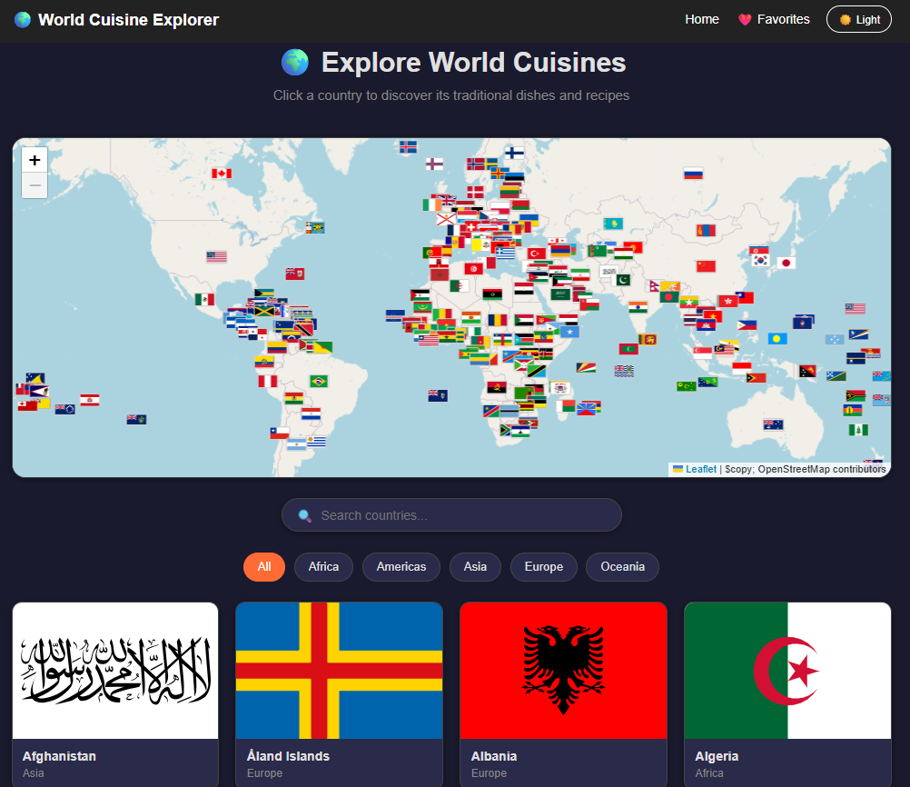

# 🌍 World Cuisine Explorer

A React application for exploring world cuisines, traditional dishes, and recipes by country. Built with React, React Router, and multiple APIs.

🔗 **[Live Demo](https://sv189.github.io/world-cuisine-explorer/)** 

---

## 📸 Screenshot

 

---

## ✨ Features

- 🗺️ Interactive world map with country flag markers
- 🌎 Browse all 250 countries with flag cards
- 🔍 Search countries by name with debounced input
- 🌐 Filter countries by region — Africa, Americas, Asia, Europe, Oceania
- 🍽️ Explore traditional dishes for each country
- 📖 Full recipe detail page with ingredients and step-by-step instructions
- 🎥 YouTube video tutorial embed on recipe pages
- ❤️ Save favorite recipes with localStorage persistence
- 🌙 Dark mode toggle
- 💀 Skeleton loaders for smooth loading experience
- 📱 Fully responsive mobile layout

---

## 🛠️ Tech Stack

- **React** — component architecture, hooks (useState, useEffect, useContext, useReducer)
- **React Router** — multi-page navigation with URL parameters
- **Context API** — global state for favorites and dark mode
- **Custom Hooks** — reusable `useFetch` hook for all API calls
- **Leaflet + React-Leaflet** — interactive world map
- **CSS Modules** — component-scoped styling
- **TheMealDB API** — recipe and dish data
- **REST Countries API** — country information and flags

---

## 📁 Project Structure
```
src/
├── components/       # Reusable UI components
│   ├── Navbar.jsx
│   ├── CountryCard.jsx
│   ├── DishCard.jsx
│   ├── SkeletonCard.jsx
│   ├── SearchBar.jsx
│   └── WorldMap.jsx
├── pages/            # Route-level page components
│   ├── Home.jsx
│   ├── CountryPage.jsx
│   ├── DishPage.jsx
│   └── FavoritesPage.jsx
├── context/          # Global state management
│   ├── FavoritesContext.jsx
│   └── ThemeContext.jsx
├── hooks/            # Custom React hooks
│   └── useFetch.js
└── styles/           # Component CSS files
```

---

## 🚀 Running Locally

1. Clone the repository:
```bash
   git clone https://github.com/sv189/world-cuisine-explorer.git
```
2. Install dependencies:
```bash
   npm install
```
3. Start the development server:
```bash
   npm run dev
```
4. Open `http://localhost:5173`

---

## 🧠 What I Learned

- Building multi-page React applications with React Router
- Managing global state with Context API and useReducer
- Creating reusable custom hooks for API calls
- Handling multiple API integrations simultaneously
- Implementing skeleton loaders for better UX
- Dark mode using CSS variables and React Context
- Mobile-first responsive design with CSS media queries
- Integrating Leaflet maps into a React application

---

## 📝 Notes

- TheMealDB supports 37 cuisine areas — countries without a mapped cuisine show a friendly empty state
- Rating data varies by API availability
- This project uses client-side API calls for demonstration purposes. In production, API keys would be stored server-side

---

## 👨‍💻 Author

**Salean Visisombat**
[GitHub](https://github.com/sv189) · [LinkedIn](https://www.linkedin.com/in/salean-visisombat)